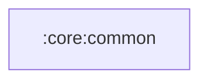

# :core:common

Pure Kotlin/JVM module: shared UI state type (`UiState`, kept in the
`com.manishraj.saavnmusic.domain` package for import compatibility),
coroutine dispatcher qualifiers (`@DispatcherIO`, `@DispatcherDefault`,
`@DispatcherMain`) and their Hilt providers.

