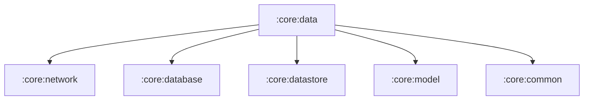

# :core:data

The single source of truth: `MusicRepository` orchestrates
:core:network (remote), :core:database (local library) and
:core:datastore (settings). Features depend on this module — never on
the network/database modules directly. `DataModule` provides the API
client (it needs settings, which sit in :core:datastore).

