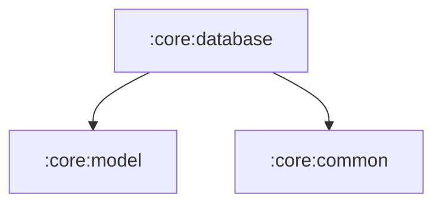

# :core:database

Room database for the on-device library: favourites, downloads, history,
recent searches and local playlists (entities + `LibraryDao` +
`AppDatabase`), with `DatabaseModule` providing them via Hilt.

Invariants from the modularization: database name `saavn-music.db`,
version 1, same entities — existing installs keep their data. Exported
schemas live in `schemas/` (schema export was switched on during the
move; the schema itself is unchanged).

