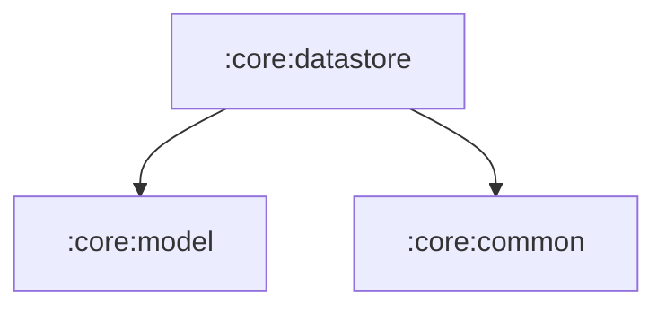

# :core:datastore

Preferences DataStore settings (`SettingsRepository` + `AppSettings`) and
`DataStoreModule`. The preferences file is still named `settings` and the
keys are unchanged, so existing installs keep their values.

