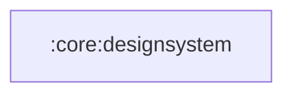

# :core:designsystem — author contract

Compose design system: `SaavnTheme`, color/type/shape tokens and the
shared spacing/radius token objects. Depends on Compose only — never
on models, data or features.

Binding source for everything below:
`~/workspace/sdlc/m3-expressive/M3_EXPRESSIVE_SPEC.md` (Option E: BOM
2026.09.00 + material3 pinned `1.5.0-alpha29`; every expressive opt-in
is recorded in `docs/sdlc/EXPRESSIVE_OPTINS.md`). This file is the
short contract a component/screen author needs day to day. Where it
and the spec disagree, the spec wins.

## Wrapper discipline (non-negotiable)

- Expressive APIs are consumed ONLY through `:core:designsystem`
  (theme, tokens) and `:core:ui` (components). Feature modules never
  import an expressive API directly — a breaking alpha rename must
  touch one file per component, never ten screens.
- Every new `@OptIn(ExperimentalMaterial3ExpressiveApi::class)` site
  goes into `docs/sdlc/EXPRESSIVE_OPTINS.md` in the same commit.

## Doctrine (spec §1, the parts that change decisions)

1. **One hero: the full Player.** Home/Search/Library/Settings stay
   deliberately calm; Detail headers are a half-hero. Expression is
   dosed by goal importance — uniform expressiveness is the
   anti-pattern.
2. **Artwork color enters the role system.** Palette colors map to
   Material roles (vibrant → tertiary family, muted → surfaceContainer
   family). `safeGradientEnd()`'s 4.5:1 guarantee is never repealed.
3. **Primary is scarce; tertiary carries expression.** Primary = the
   ONE key action per screen (Play), selection, active states.
4. **Emphasized type = weight, not size.** Baseline and emphasized
   styles are used together at the same sizes — no reflow at font
   scale 1.33 or 2.0.
5. **Never break the song list.** Expression goes into headers, the
   player, containment and motion — never into rearranging tracks or
   stripping row labels.
6. **Springs, with doctrine.** One scheme: `MotionScheme.expressive()`
   at the theme. Spatial may overshoot; effects (color/alpha) never
   do. Reading surfaces (track lists, lyrics) stay calm — choose
   standard-feeling specs there.
7. **Shape is feedback.** Morph on press/selection for transport
   controls and toggles. Dense cards/rows keep quiet corners.
8. **Hierarchy = surface containers + space**, not shadow or colour.

## Typography usage (spec §2.2)

- `displaySmallEmphasized` — Player song title (the hero) only.
- `headlineMediumEmphasized` / `titleLargeEmphasized` — Detail header
  titles; Home greeting.
- `titleMediumEmphasized` — section headers on Home ("Jump back in",
  rail titles): the ONE emphasis allowed on calm screens.
- Everything else is baseline. **Rows are never emphasized.**
- Player time labels use `TabularTimeStyle` (tabular figures, no
  jitter).

## Color, shape, spacing tokens

- Semantic roles only in screens; raw hex lives in `Theme.kt`.
  Non-dynamic scheme: primary green `#3BE477` (dark) for action and
  selection; surfaces keep the `#0F0F23/#12122B` identity in the
  container scale rather than flat background everywhere. With dynamic
  color ON, the wallpaper scheme owns the roles and only surfaces
  re-tint (primary stays brand green by design).
- Shapes come from `MaterialTheme.shapes` (`OmegaShapes`): artwork =
  `medium` (12) in rows, `large` (16) on cards, `extraLarge` (28) in
  the player hero; the `…Increased` / `extraExtraLarge` slots extend
  the same scale for hero surfaces.
- Spacing from `OmegaSpacing` (4dp base: 4/8/12/16/24/32/48). No
  ad-hoc dp values in shared components.

## Motion (spec §2.5, §4)

- Read specs from `MaterialTheme.motionScheme` — never hand-tune a
  tween where a token exists: palette crossfades →
  `defaultEffectsSpec()` via the shared `animatePaletteColor` helper
  in `:core:ui`; icon morphs → `fastEffectsSpec()` crossfade +
  `fastSpatialSpec()` scale; shared-element artwork flight →
  `slowSpatialSpec()`. NEVER spring the seek value (clock data).
- `OmegaMotion` easings remain the documented fallback set for the
  shell transitions until Wave 3 re-bases them.
- **Reduced motion is binary** (`LocalReducedMotion`, provided by
  `SaavnTheme`, re-read on ON_RESUME): scale 0 → snap + crossfade
  only. Every new animated component must define its reduced behavior;
  shimmer and the palette helper already consume the local.

## Accessibility (spec §8)

- 4.5:1 text / 3:1 large + non-text contrast; palette text uses the
  contrast-checked on-colors, never `onSurfaceVariant` on artwork.
- 48dp touch-target floor survives expressive's smaller visuals.
- State is never color-only: toggles (shuffle/repeat/speed/favorite)
  carry `stateDescription`/content descriptions; loading states
  announce via live-region semantics (`OmegaLoadingIndicator` does).
- New components ship `@Preview`s, including `@PreviewFontScale`
  1.33 and 2.0 where layout could crush (rows, player, sheets).

