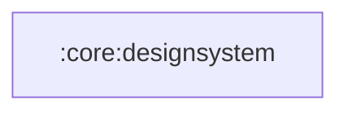

# :core:designsystem

Compose design system: `SaavnTheme` (renamed `OmegaTheme` in the redesign
phase), color/type tokens and shared spacing/radius token objects.
Depends on Compose only — never on models, data or features.

(Contents move here in Phase A; tokens are replaced per
`docs/sdlc/REDESIGN_SPEC.md` in Phase C.)

