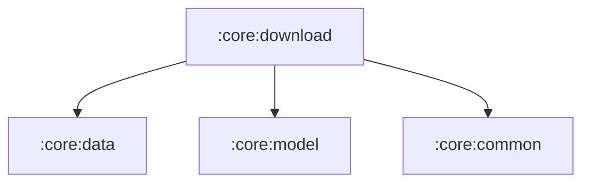

# :core:download

User-initiated downloads (Omega's analogue of Now in Android's
`:sync:work`): the WorkManager `DownloadWorker` plus the
`DownloadModule` bindings. Workers are discovered by Hilt's worker
factory, which `SaavnApplication` (:app) installs as the WorkManager
Configuration.Provider.

