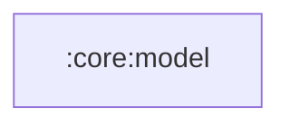

# :core:model

Pure Kotlin/JVM module (no Android APIs): the app-wide domain models
`Song`, `Album`, `Playlist`, `Artist` plus pure formatting/naming helpers
(`formatDuration`, `sanitizeFileName`, `downloadFileName`).

Package stays `com.manishraj.saavnmusic.domain` (pure `git mv` migration —
packages did not change when the module was created).

