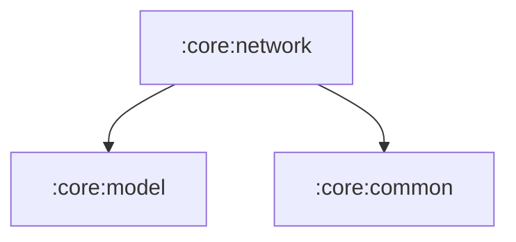

# :core:network

Everything that talks HTTP: the API client, the raw upstream DTOs and the
DTO → domain mappers (kept beside the client that produces them, Now in
Android style), plus `NetworkModule` (Json + OkHttpClient).

Phase B note: this module no longer calls a hosted wrapper — it builds
JioSaavn's own `api.php` calls directly (see `docs/sdlc/UPSTREAM_SPEC.md`
and `UPSTREAM_VALIDATION.md`).

