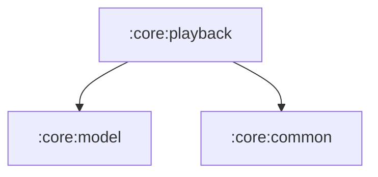

# :core:playback

Playback engine: `PlayerController` (the @Singleton facade the UI talks
to), `PlayerState`, and the Media3 `PlaybackService`. The service's
manifest entry lives in this module and merges into the app manifest —
verify it survives merging (foregroundServiceType="mediaPlayback" +
MediaSessionService intent filters) when building.

Player *UI* is not here — that is :feature:player.

