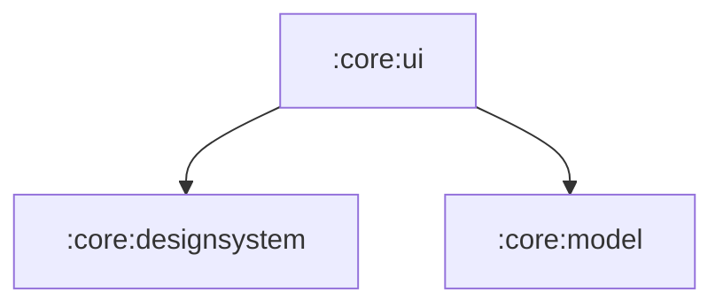

# :core:ui

Model-aware shared composables (`Artwork`, `SongRow`, `MediaCard`,
loading/error/empty states, section headers). Components take domain
models + lambdas only — never ViewModels or repositories (Now in Android
`core:ui` rule).

