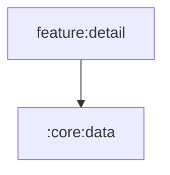

# :feature:detail

Album / playlist / artist detail screens (one journey: open a collection, play its songs).

Navigation is received as lambdas from `:app` (no feature depends on
another feature). Shared UI comes from `:core:ui` / `:core:designsystem`
via the `omega.android.feature` convention plugin.

