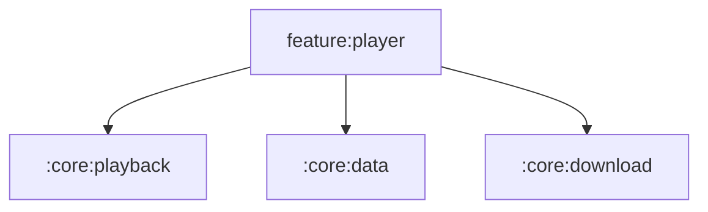

# :feature:player

Player UI: mini-player, full player, queue sheet, lyrics. Playback engine lives in :core:playback.

Navigation is received as lambdas from `:app` (no feature depends on
another feature). Shared UI comes from `:core:ui` / `:core:designsystem`
via the `omega.android.feature` convention plugin.

