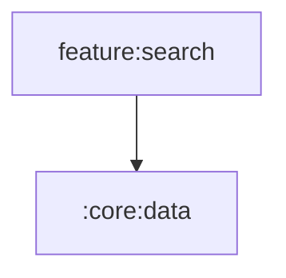

# :feature:search

Search with typed tabs (songs/albums/artists/playlists) and recent searches.

Navigation is received as lambdas from `:app` (no feature depends on
another feature). Shared UI comes from `:core:ui` / `:core:designsystem`
via the `omega.android.feature` convention plugin.

