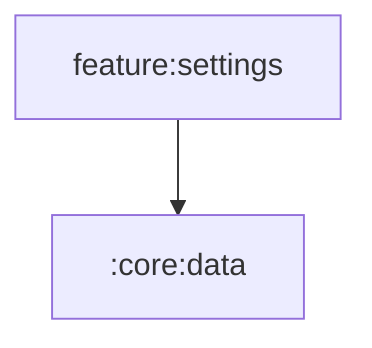

# :feature:settings

Settings: endpoint override, qualities, theme. Depends on :core:data only (NiA settings pattern).

Navigation is received as lambdas from `:app` (no feature depends on
another feature). Shared UI comes from `:core:ui` / `:core:designsystem`
via the `omega.android.feature` convention plugin.

